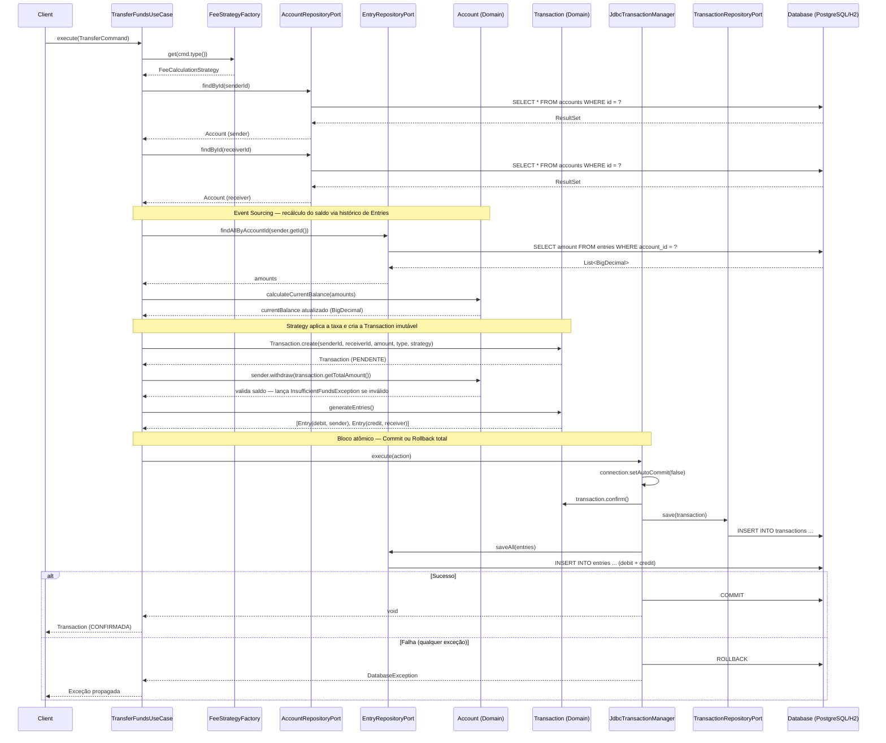

# 🏦 Gateway de Pagamentos — Arquitetura de Sistemas

> **Trabalho Final da Unidade Curricular de Arquitetura de Sistemas**
> SENAI — Professor Lucas Santos da Silva
> Autores: **Pablo Ruan Tzeliks** e **Bruno Luís Medeiros**


---

## 📖 Sobre o Projeto

Este repositório é o resultado de um exercício acadêmico com propósito muito além do comum: **demonstrar, de forma prática e irrefutável, o valor real da Engenharia de Software bem feita.**

Para isso, construímos **dois módulos que resolvem exatamente o mesmo problema** — um Gateway de Pagamentos / Sistema Bancário simples — mas com abordagens radicalmente opostas:

| Módulo | Filosofia | Resultado |
|---|---|---|
| `chaos-project` | Zero arquitetura, código escrito "na raça" | Funciona, mas é frágil, impossível de testar e de manter |
| `clean-project` | Clean Architecture, DDD, SOLID, testes | Robusto, testável, extensível e correto por design |

A dualidade entre os módulos é a própria tese do trabalho: **arquitetura não é burocracia, é a diferença entre um software que sobrevive ao tempo e um que se destrói sozinho.**

---

## 💀 Módulo Chaos — O Antipadrão Intencional

O `chaos-project` foi construído deliberadamente violando todos os princípios de engenharia de software. Seu único arquivo relevante, `GodChaos.java`, concentra em si toda a lógica de negócio, acesso ao banco de dados, validação e controle de fluxo — uma classe que faz absolutamente tudo.

**Problemas introduzidos de forma proposital:**

- **`float` para dinheiro** — tipo de ponto flutuante com erros de precisão, inaceitável para valores monetários.
- **God Class / God Method** — toda a lógica na `main()`, sem nenhuma separação de responsabilidades.
- **Modelos anêmicos** — `Account` e `Transaction` são apenas bags of data, sem comportamento de domínio.
- **SQL hardcoded na lógica de negócio** — acoplamento total entre regras de negócio e infraestrutura de persistência.
- **Ausência total de testes** — impossível garantir que uma mudança não quebre outra funcionalidade.
- **Taxas hardcoded com `if/else`** — adicionar um novo tipo de transação exige mexer no coração do sistema.
- **Sem tratamento de transações ACID** — operações de crédito e débito podem ficar inconsistentes em caso de falha.

---

## ✨ Módulo Clean — A Obra-Prima Arquitetural

O `clean-project` é onde a engenharia de software mostra seu valor real. Cada decisão foi tomada com intenção, baseada em princípios sólidos e validada por testes automatizados.

### 🏛️ Arquitetura

O projeto segue os princípios da **Clean Architecture** com influências da **Arquitetura Hexagonal (Ports & Adapters)**:

```
clean-project/
├── domain/                    # Núcleo — sem dependências externas
│   ├── account/model/         # Entidade Account (rich model)
│   ├── entry/model/           # Entidade Entry (lançamento contábil)
│   ├── transaction/model/     # Entidade Transaction + TransactionType
│   ├── transaction/strategy/  # Strategy Pattern para cálculo de taxas
│   └── user/model/            # Entidade User
│
├── application/               # Casos de Uso — orquestram o domínio
│   ├── transaction/usecase/   # TransferFundsUseCase
│   ├── account/usecase/       # AddNewAccountUseCase
│   └── user/usecase/          # AddNewUserUseCase
│
└── infrastructure/            # Adapters — detalhes de implementação
    └── persistence/
        ├── database/          # Pool de conexões JDBC customizado
        └── repository/        # Implementações dos Ports
```

A **regra de dependência** é sempre respeitada: o domínio não conhece a infraestrutura. A inversão de dependência é garantida pelos **Ports** (interfaces) que o domínio define e a infraestrutura implementa.


---

### 🧠 Modelagem Rica de Domínio (DDD)

Em vez de modelos anêmicos, cada entidade carrega comportamento e protege seus próprios invariantes:

- **`Account`**: valida e rejeita saques com saldo insuficiente (`InsufficientFundsException`). O saldo (`currentBalance`) não é persistido no banco — ele é **calculado em tempo real** a partir dos lançamentos.
- **`Transaction`**: criada através de um factory method `Transaction.create(...)` que garante que a taxa já é calculada no momento da criação. Possui estado de confirmação (`confirm()` / `isConfirmed()`), protegido contra dupla confirmação.
- **`Entry`**: representa um lançamento contábil com semântica clara de crédito (`createCredit`) e débito (`createDebit`), usando valores negativos para débitos — tornando o cálculo de saldo uma simples soma.
- **`User`**: entidade simples que representa o titular de uma conta.

---

### 💡 Event Sourcing para Cálculo de Saldo

Esta é uma das decisões mais elegantes do projeto. **O saldo da conta não existe como coluna no banco de dados.** Em vez disso, o banco armazena apenas o histórico imutável de `Entries` (lançamentos de crédito e débito).

Sempre que o saldo precisa ser validado, o sistema reconstrói o estado atual do domínio:

```java
// No TransferFundsUseCase:
sender.calculateCurrentBalance(entryRepository.findAllByAccountId(sender.getId()));
```

```java
// Na entidade Account:
public void calculateCurrentBalance(List<BigDecimal> amounts) {
    this.currentBalance = amounts.stream()
            .reduce(BigDecimal.ZERO, BigDecimal::add);
}
```

**Por que isso é melhor?** Porque o banco de dados nunca mente — cada centavo que entrou e saiu está registrado, a regra de negócio vive no domínio (e não em um `SELECT balance FROM accounts`), e a consistência é garantida por design, sem depender de um `UPDATE` atômico no saldo.


---

### 🎯 Strategy Pattern para Taxas de Transação

As taxas de transação são calculadas dinamicamente através do **padrão Strategy**, eliminando qualquer `if/else` ou `switch` na lógica de negócio:

| Tipo de Transação | Taxa | Implementação |
|---|---|---|
| PIX | 0% | `PixStrategy` |
| TED / Boleto | 0,5% | `TedStrategy` |
| Cartão de Débito | 1% | `DebitCardStrategy` |
| Cartão de Crédito | 3,5% | `CreditCardStrategy` |

A `FeeStrategyFactory` resolve qual estratégia usar com base no `TransactionType`. Adicionar um novo método de pagamento é tão simples quanto criar uma nova classe que implemente `FeeCalculationStrategy` — **nenhuma regra existente precisa ser tocada (OCP do SOLID).**

```java
// Domínio limpo: sem switch, sem if. A strategy faz o trabalho.
FeeCalculationStrategy strategy = FeeStrategyFactory.get(cmd.type());
Transaction transaction = Transaction.create(sender.getId(), receiver.getId(),
                                             cmd.amount(), cmd.type(), strategy);
```

---

### 🔄 Gerenciamento Customizado de Transações JDBC

Uma das peças mais sofisticadas da infraestrutura é o gerenciador de transações construído do zero, sem frameworks. O padrão **Execute Around** foi aplicado para envolver operações de banco de dados com commit/rollback automático.

O `JdbcTransactionManager` gerencia o ciclo de vida de uma conexão transacional, enquanto o `ConnectionContext` (baseado em `ThreadLocal`) compartilha a conexão ativa com todos os `Repository Adapters` dentro do mesmo escopo transacional — simulando exatamente o comportamento do `@Transactional` do Spring.

```
TransactionManager.execute(action)
  ├── Obtém conexão do DataSource
  ├── Desativa autoCommit
  ├── Coloca conexão no ConnectionContext (ThreadLocal)
  ├── Executa a action (Repositories reutilizam a mesma conexão)
  ├── Commit → sucesso
  └── Rollback → em caso de qualquer exceção
```

O `QueryExecutor` aplica o padrão **Execute Around** com `StatementCallback`, reduzindo drasticamente o código boilerplate nos repositórios: toda a gestão de `PreparedStatement` e tratamento de `SQLException` fica centralizada em um único lugar.

---

## 🔀 Fluxo do `TransferFundsUseCase`

O diagrama abaixo detalha o fluxo de dados completo da transferência bancária, desde o recebimento do comando até a confirmação atômica no banco de dados:



---

## ✅ Qualidade e Testes

A suíte de testes foi construída em três camadas, sem concessões:

### Testes Unitários (`*Test.java`)
Testam o núcleo do domínio de forma isolada, com Mockito para simular dependências externas.

- **`AccountTest`** — valida regras de saque, depósito e recálculo de saldo por Event Sourcing.
- **`TransactionTest`** — valida criação, confirmação e geração de entries.
- **`FeeStrategyTest`** — valida as quatro estratégias de taxa com parametrização.

### Testes de Integração (`*IT.java` com banco H2)
Testam os `Repository Adapters` contra um banco H2 em memória real — **sem nenhum mock de banco de dados.**

- **`AccountRepositoryAdapterJdbcIT`**
- **`TransactionRepositoryAdapterJdbcIT`**
- **`EntryRepositoryAdapterJdbcIT`**

### Teste E2E (`BankingFlowE2EIT`)
O teste mais completo: simula um fluxo bancário real com múltiplas transferências, recalcula o saldo via Event Sourcing e valida os valores finais com precisão decimal, tudo contra o banco H2 em memória.

### Cobertura (JaCoCo)

| Camada | Cobertura |
|---|---|
| Domínio (núcleo) | ~100% |
| Aplicação (Use Cases) | Alta |
| Infraestrutura | Coberta por testes de integração |
| **Total** | **~80%** |


---

## 🏆 Desafios e Aprendizados

### Pablo Ruan Tzeliks — Infraestrutura e DDD

O maior desafio foi construir a infraestrutura de persistência **completamente do zero, sem nenhum ORM**. Foi necessário recriar a mecânica que frameworks como JPA/Hibernate fornecem automaticamente:

- Implementação do padrão **Execute Around** no `QueryExecutor` com `StatementCallback`, centralizando o boilerplate de JDBC e reduzindo drasticamente o código dos `Repository Adapters`.
- Criação de uma **pool de conexões manual** com o `DataSource` e gerenciamento de ciclo de vida de `Connection`.
- Implementação do `JdbcTransactionManager` com `ThreadLocal` (`ConnectionContext`) para simular o comportamento do `@Transactional`, garantindo que todos os repositórios dentro de um mesmo caso de uso utilizem a mesma conexão e participem da mesma transação ACID.
- Modelagem precisa das entidades de domínio seguindo os princípios do **DDD**, garantindo que as regras de negócio residam nas entidades e não nos serviços de aplicação.

### Bruno Luís Medeiros — Domínio e Aplicação

O desafio foi garantir que os **Casos de Uso** orquestrassem a lógica de negócio de forma limpa, coesa e testável:

- Estruturação do `TransferFundsUseCase` de maneira que toda a complexidade de validação, cálculo e persistência ficasse organizada sem vazar responsabilidades entre camadas.
- Engenharia do **Event Sourcing** para que o cálculo de saldo acontecesse exclusivamente no domínio, sem que a arquitetura dependesse de uma coluna `balance` no banco de dados para validar regras vitais de negócio.
- Aplicação do **padrão Strategy** para cálculo de taxas de forma que o domínio permanecesse fechado para modificação e aberto para extensão (OCP).

---

## 🚀 Como Executar

### Pré-requisitos

- Java 21+
- Maven 3.x
- PostgreSQL (para o `chaos-project` e o `clean-project` em produção)

### Executando os Testes (clean-project)

Os testes do `clean-project` são totalmente autossuficientes — usam H2 em memória e não precisam de PostgreSQL.

```bash
cd clean-project
mvn test
```

### Gerando o Relatório de Cobertura JaCoCo

```bash
cd clean-project
mvn verify
# Relatório disponível em: clean-project/target/site/jacoco/index.html
```

### Configurando o Banco de Dados (produção)

Configure as variáveis de conexão no `DataSource` para apontar para sua instância PostgreSQL antes de executar os módulos em modo de produção.

---

## 🗂️ Estrutura do Repositório

```
system-architecture-challenge/
├── chaos-project/         # Módulo antipadrão (propositalmente ruim)
│   └── src/main/java/
│       └── GodChaos.java  # A classe que faz tudo (o horror)
│
├── clean-project/         # Módulo profissional
│   ├── src/main/java/
│   │   └── senai/centroweg/
│   │       ├── domain/        # Entidades, regras e ports
│   │       ├── application/   # Casos de uso
│   │       └── infrastructure/ # Adapters JDBC e banco de dados
│   └── src/test/java/
│       └── senai/centroweg/   # Testes unitários, de integração e E2E
│
└── pom.xml                # POM raiz (multi-módulo Maven)
```

---

## 📐 Diagramas

### Diagrama de Classes — Domínio (clean-project)


### Diagrama de Decisões Arquiteturais


---

*Este projeto foi desenvolvido como trabalho acadêmico final para a Unidade Curricular de Arquitetura de Sistemas do SENAI, sob orientação do Prof. Lucas Santos da Silva. Todo o código foi escrito pelos autores com o objetivo de demonstrar, na prática, o impacto das escolhas arquiteturais na qualidade, manutenibilidade e corretude de um sistema de software.*
